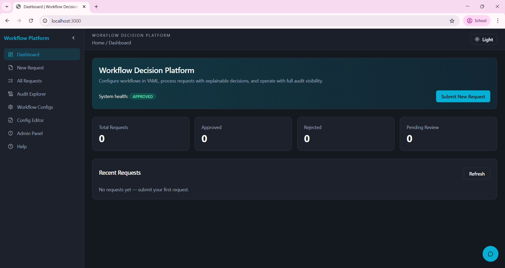
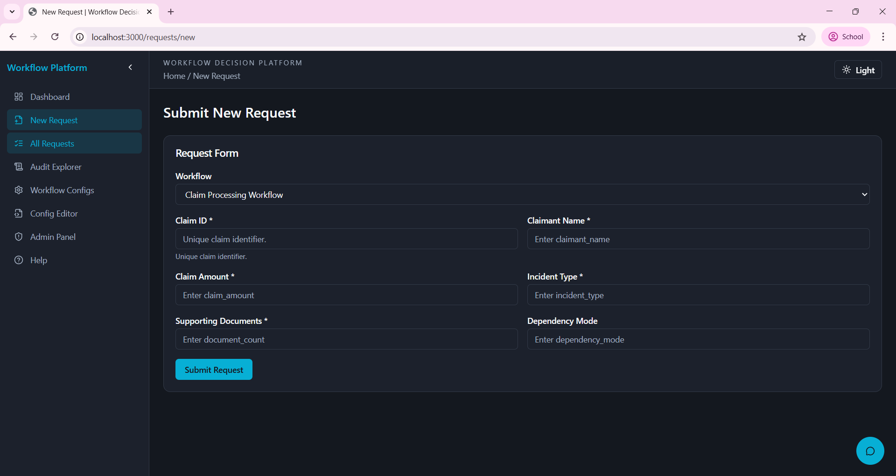
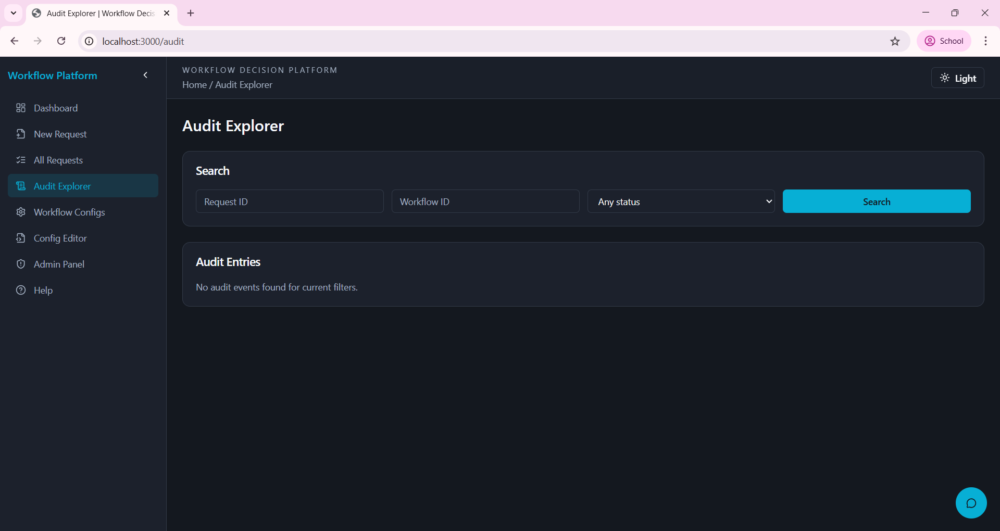
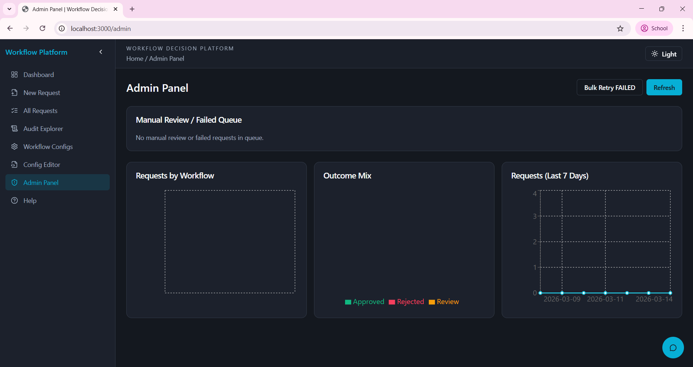

# Workflow Decision Platform

A production-ready, configuration-driven workflow platform for structured decisioning. The system combines a FastAPI backend, a React operations console, YAML-defined workflows, auditability, retries, and admin controls.

This repository is intentionally simplified: the active implementation is under `workflow-platform/`.

## Why This Project

Most approval and operations processes change frequently. Hard-coding business rules into application code slows teams down and makes changes risky. This platform solves that by moving workflow behavior into YAML configuration while preserving:

- deterministic rule execution
- explainable outcomes
- full audit history
- operational controls (retry, override, queue views)

## Core Capabilities

- FastAPI backend with OpenAPI docs (`/docs`)
- React + TypeScript frontend for operations users
- YAML workflow definitions (5 built-in workflows)
- Request intake with idempotency support
- Stage-based rule evaluation and routing
- External dependency simulation + retry/backoff policy
- Complete request lifecycle and audit trail
- Admin endpoints for queue, retry, override, and metrics
- Automated backend and frontend tests

## Repository Structure

```text
.
├─ workflow-platform/
│  ├─ backend/                 # FastAPI app, engine, YAML loader, tests
│  ├─ frontend/                # React operations console
│  ├─ docker-compose.yml       # Full stack local startup
│  ├─ ARCHITECTURE.md          # Component and data-flow design
│  └─ DECISION_EXAMPLES.md     # Example decision traces
└─ README.md                   # This repository overview
```

## Tech Stack

- Backend: Python, FastAPI, SQLAlchemy, SQLite, PyYAML
- Frontend: React, TypeScript, Vite, Tailwind, Zustand, Recharts
- Testing: Pytest, Vitest, React Testing Library
- Containerization: Docker, Docker Compose

## Prerequisites

- Python 3.11+
- Node.js 18+
- npm 9+
- Docker Desktop (optional, recommended for quick setup)

## Quick Start (Docker Recommended)

From `workflow-platform/`:

```bash
docker compose up --build
```

Open:

- Frontend: http://localhost:3000
- Backend root: http://localhost:8000
- API docs: http://localhost:8000/docs

## Local Development Setup

### 1) Backend

```powershell
cd workflow-platform/backend
python -m venv .venv
.\.venv\Scripts\Activate.ps1
pip install -r requirements.txt
python -m uvicorn main:app --host 127.0.0.1 --port 8000 --reload
```

### 2) Frontend

Open a second terminal:

```powershell
cd workflow-platform/frontend
npm install
npm run dev -- --host=127.0.0.1 --port=3000
```

## Run Tests

### Backend tests

```powershell
cd workflow-platform/backend
pytest -q
```

### Frontend tests

```powershell
cd workflow-platform/frontend
npm run test
```

## Built-in Workflow Configurations

YAML files are in `workflow-platform/backend/config/workflows/`:

- `loan_approval.yaml`
- `vendor_approval.yaml`
- `claim_processing.yaml`
- `employee_onboarding.yaml`
- `document_verification.yaml`

To add a new workflow, create another YAML file in the same folder with a unique `workflow_id`, payload schema, stages, rules, and retry policy.

## Key API Endpoints

- `GET /health` - health check
- `POST /api/requests` - submit/process request
- `GET /api/requests` - list requests
- `GET /api/requests/{request_id}` - request details
- `GET /api/workflows` - list workflow configs
- `POST /api/admin/retry/{request_id}` - retry failed request
- `POST /api/admin/override/{request_id}` - manual approve/reject
- `GET /api/admin/metrics` - operations metrics

## Documentation

- Architecture: `workflow-platform/ARCHITECTURE.md`
- Decision examples: `workflow-platform/DECISION_EXAMPLES.md`

## Screenshots

Store your project images in:

- `workflow-platform/docs/screenshots/`

Then reference them in README with repository-relative paths so they render on GitHub.

Example gallery:







If your file names are different, update the image paths above to match exactly.

## Upload Images To GitHub

If pasting directly into the README editor is blocked, upload images as files first:

1. Open your repository on GitHub.
2. Go to `workflow-platform/docs/screenshots/`.
3. Click **Add file** -> **Upload files**.
4. Upload your PNG or JPG images and commit.
5. Ensure README image links use the same exact file names.

## Notes

- Root-level legacy stacks were removed to keep this repository clean and focused on the active production platform.
- The backend uses SQLite by default and can be switched to PostgreSQL via `DATABASE_URL`.


