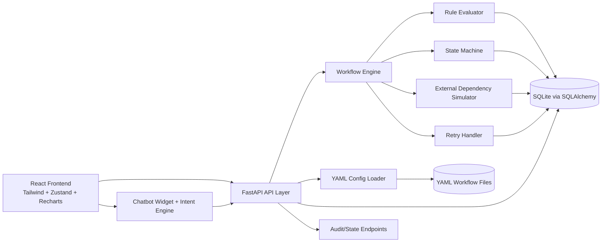

# Architecture

## 1. System Overview Diagram

## 2. Component Descriptions

- API Layer:
  - FastAPI routers split by concern: requests, workflows, audit, admin.
  - Exposes OpenAPI docs at `/docs`.
- Engine:
  - Loads workflow by `workflow_id`.
  - Executes stages and rule sets.
  - Applies terminal decisions and writes response snapshot.
- Rule Evaluator:
  - Supports `mandatory`, `threshold`, `conditional` rules.
  - Operators: `eq`, `neq`, `gt`, `gte`, `lt`, `lte`, `contains`, `regex`.
- State Machine:
  - Allowed states: `PENDING`, `IN_PROGRESS`, `APPROVED`, `REJECTED`, `MANUAL_REVIEW`, `RETRYING`, `FAILED`.
  - Every transition is persisted in `state_history`.
- Audit Logger:
  - Captures rule evaluations, external calls, retries, and idempotency events.
- Config Loader:
  - Validates YAML against Pydantic models.
  - Enables config hot-reload behavior by loading from disk per request.
- External Simulator:
  - Deterministic simulated outcomes based on failure rate + payload control flags.

## 3. Data Flow

1. `POST /api/requests` receives payload.
2. API validates workflow + payload schema.
3. Idempotency check by `request_id`:
   - Duplicate -> return existing record with `X-Idempotent: true`.
4. Engine transitions request: `PENDING -> IN_PROGRESS`.
5. Stage loop executes:
   - evaluate rules
   - call external dependencies for external stages
   - apply retry policy when needed
6. State transitions and audit logs are persisted.
7. Terminal status set and response snapshot stored.
8. UI consumes `/api/requests/:id` and `/api/audit/:id` for explainability.

## 4. Database Schema

- `requests`
  - `request_id` (PK)
  - `workflow_id`
  - `status`
  - `payload_json`
  - `payload_hash`
  - `response_json`
  - `attempt_count`
  - `processing_ms`
  - `admin_note`
  - `failure_reason`
  - `created_at`, `updated_at`
- `audit_logs`
  - `id` (PK)
  - `request_id`, `workflow_id`
  - `event_type`, `stage`, `rule_id`
  - `field`, `operator`, `expected_value`, `actual_value`
  - `result`, `explanation`, `details_json`
  - `timestamp`
- `state_history`
  - `id` (PK)
  - `request_id`
  - `from_state`, `to_state`
  - `reason`
  - `timestamp`
- `workflow_configs`
  - `workflow_id` (PK)
  - `name`, `description`, `version`
  - `yaml_content`
  - `updated_at`

## 5. Configuration Model

Each YAML workflow defines:

- `workflow_id`, `name`, `description`, `version`
- `payload_schema` for dynamic frontend form + backend validation
- `stages` with:
  - `name`, `type` (`auto|manual|external`)
  - transition routes (`on_success`, `on_failure`, `on_retry`)
  - per-stage `rules`
- `retry_policy`
- optional global `external_dependency`

The loader maps YAML -> typed Pydantic model, then engine behavior follows configuration only.

## 6. Tradeoffs and Assumptions

- SQLite chosen for simplicity and local portability; PostgreSQL recommended in production.
- Execution is synchronous per request for deterministic tests and simpler operations.
- Configs are read from disk on demand (hot-reload friendly), not yet cached.
- Retry sleeps are capped to keep CI/test execution practical.

## 7. Scaling Considerations

- Horizontal scaling:
  - FastAPI app is stateless; run multiple workers behind a load balancer.
- Queue-based execution:
  - Move engine execution to Celery/RQ workers for long-running workflows.
- Database:
  - Migrate to PostgreSQL and use pooled async engines for throughput.
- Config storage:
  - Store workflow configs in DB/object storage for multi-instance consistency.
- Audit writes:
  - Batch writes or async logging for high-volume workloads.
